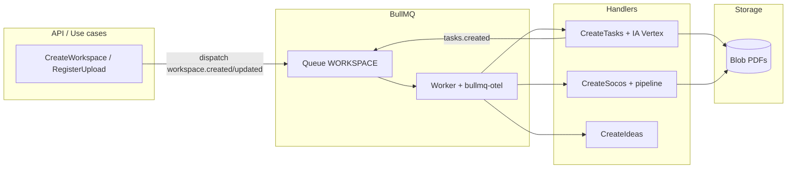

# Replicação do pós-upload: análise de PDF por IA, SOCOS e ideias

Este guia descreve o **caminho arquitetural** usado neste repositório para, após o PDF (e diretrizes) estarem disponíveis no storage, **enfileirar jobs**, **analisar o documento com IA** (Google Vertex via Vercel AI SDK) e **gerar tarefas (fluxo), SOCOS e ideias**. Outro projeto pode seguir o mesmo padrão adaptando domínio, persistência e nomes de eventos.

> **Se o outro projeto já tem upload funcionando** e o objetivo é **só validar** o encadeamento *upload → análise (passos) → SOCOS simplificado → ideias simplificadas*, vá direto para a **seção 10** (*Passo a passo no outro projeto*). Lá o fluxo é descrito em comentários implementáveis, sem depender dos nomes `workspace`, `DTP` ou SAS deste repositório.

### Leitores sem o código do vsideation — este arquivo é suficiente?

**Como blueprint de arquitetura (eventos → BullMQ → workers → Vertex → persistência), sim, dá para orientar a implementação.** Para uma **cópia comportamental equivalente** (mesmos outputs de SOCOS, mesmas estruturas de ideias, mesmas validações), **não**: seria necessário portar ou reescrever **schemas Zod**, **prompts**, o **pipeline SOCOS** (várias etapas de `generateObject` e lógica determinística em `socos-generation-pipeline.ts` e `types/socos-pipeline`) e trechos de **domínio** (`workspace.ts`, entidades de ideia, etc.).

**Escopo mínimo viável só com este doc (alinhado ao outro projeto de validação):** fila Redis (ou um único worker in-process só para PoC), **um ponto único após o upload concluído** que enfileira um job com `{ resourceId, fileUrl, mimeType }`, worker que **baixa o binário** da URL, **`generateObject`** para extrair **passos** do PDF, em seguida **outra chamada** (ou outro job) para **SOCOS leve** e **ideias leves** — tudo com schemas Zod **bem menores** que os do vsideation. O importante é repetir o **mesmo desacoplamento**: API não fica esperando a IA; o processamento assíncrono falha e retenta como job.

**Para paridade com SOCOS deste produto:** trate este markdown como **índice**; o trabalho real é copiar/adaptar o módulo de IA SOCOS (e testes associados) do repositório fonte, ou aceitar um SOCOS simplificado.

**Lacunas típicas ao implementar só pelo texto:** formato exato dos payloads de evento (campos, tipos, serialização do `context` para JSON do BullMQ), regras de `regenerateTasks` / `regenerateSocos`, máquina de estados do agregado (`PENDING` / `PROCESSING` / `COMPLETED` / `FAILED`), fluxo SAS no cliente, tamanho de PDF e limites do modelo, tratamento de timezone em jobs, e **Zod 4** (`zod` neste repo é a linha 4.x — alinhar com o que o pacote `ai` espera).

---

## 1. Visão geral do pipeline

Fluxo lógico (alto nível):

1. **Workspace criado** com arquivo já no blob **ou** com uploads pendentes (client envia direto ao storage e depois registra a URL).
2. Quando **não há uploads pendentes** e há **URL do DTP** e/ou **contexto adicional** e/ou **diretrizes já enviadas**, o backend dispara o evento `workspace.created`.
3. **Workers BullMQ** (processo Node separado do request HTTP, mas aqui acoplado ao `instrumentation` do Next) consomem jobs e executam:
   - **CreateTasks**: baixa o PDF do storage, chama IA para extrair passos estruturados, persiste `flowChartList`, dispara `tasks.created`.
   - **CreateSocos** (em paralelo / mesma rodada de jobs do mesmo evento): baixa DTP + arquivos de diretriz, pipeline SOCOS com múltiplas chamadas `generateObject`.
4. Ao receber `tasks.created`, outros handlers geram **ideias** e **insights** a partir das tarefas já materializadas.

5. Se o workspace foi criado **com upload assíncrono** (SAS), só depois do cliente chamar **register uploaded file** é que dispara `workspace.updated` para **refazer tarefas e/ou SOCOS** quando aplicável.

Arquivos de referência principais:

| Peça | Onde |
|------|------|
| Disparo inicial após create | `src/model/workspace/application/use-cases/create-workspace-use-case.ts` |
| Disparo após upload assíncrono | `src/model/workspace/application/use-cases/register-workspace-uploaded-file-use-case.ts` |
| Fila + telemetry | `src/model/workspace/infrastructure/events/bullmq-event-dispatcher.ts`, `event-worker.ts` |
| Inscrição dos handlers | `src/startup/workers.ts` |
| Boot workers | `src/instrumentation.ts` → `src/startup/index.ts` |
| IA (Vertex + `generateObject`) | `src/model/shared/infrastructure/ai/ai-runtime.ts`, `sdk-adapter.ts` |
| Pipeline SOCOS | `src/model/shared/infrastructure/ai/socos-generation-pipeline.ts` |
| Geração de tarefas a partir do PDF | `src/model/workspace/application/use-cases/create-tasks-use-case.ts` |
| SOCOS | `src/model/workspace/application/use-cases/create-socos-use-case.ts` |
| Ideias | `src/model/workspace/application/use-cases/create-ideas-use-case.ts` |

---

## 2. Dependências npm (alinhar com `package.json`)

**Recomendação:** no outro projeto, use **as mesmas versões declaradas no `package.json` deste repositório** para o stack de fila e IA abaixo (mesmos intervalos semver, por exemplo `^5.67.2`). Isso evita incompatibilidades de API entre `ai`, os providers `@ai-sdk/*`, `bullmq` e `bullmq-otel`. Se precisar de **reprodutibilidade byte a byte**, copie também as versões **resolvidas** do `bun.lock` / `package-lock.json` daqui.

Versões **atuais neste repo** (trecho de `dependencies`):

| Pacote | Versão em `package.json` |
|--------|---------------------------|
| `@ai-sdk/google-vertex` | `^4.0.37` |
| `@ai-sdk/react` | `^3.0.118` |
| `ai` | `^6.0.62` |
| `bullmq` | `^5.67.2` |
| `bullmq-otel` | `^1.1.1` |

Se este documento estiver defasado em relação ao código, **o `package.json` na raiz do vsideation é a fonte da verdade** — atualize o outro projeto para bater com ele.

Função de cada um:

- **`bullmq`** — fila e workers.
- **`bullmq-otel`** — `new BullMQOtel("Queue")` e `new BullMQOtel("Worker")` nas opções de `Queue`/`Worker` (telemetria compatível com o ecossistema BullMQ).
- **`ioredis`** — conexão Redis (ex.: `REDIS_CONNECTION_STRING`). Neste projeto não está listado diretamente em `package.json`; entra como dependência do **BullMQ** — mantenha a mesma versão de **`bullmq`** e o gerenciador resolverá o `ioredis` compatível.
- **`ai`** — `generateObject`, tipos de conteúdo multimodal.
- **`@ai-sdk/google-vertex`** — `createVertex()` como provider; `location`, `project` e credenciais via `googleAuthOptions`.
- **`@ai-sdk/react`** — **não participa do pipeline pós-upload** aqui; é para hooks de UI/streaming no cliente. Inclua só se o outro projeto tiver telas equivalentes com streaming. Mesmo assim, **mantenha a mesma versão** se quiser paridade com este front.
- **OpenTelemetry** (opcional mas usado no app): `@opentelemetry/*` conforme `src/instrumentation.ts` — inicializado **antes** do startup que sobe os workers; para paridade total, replique as versões deste `package.json`.

---

## 3. Configuração da IA (Google Vertex)

Padrão em `src/model/shared/infrastructure/ai/ai-runtime.ts`:

- Variáveis **`GENAI_KEY`** (JSON Base64 da service account com `project_id`), **`GENAI_MODEL`**, opcionalmente **`GENAI_MODEL_FLASH`** (etapas mais baratas no pipeline SOCOS).
- `createVertex({ project, location: "global", googleAuthOptions: { credentials } })`.
- Exportar **`provider`**, **`textModel`**, **`flashModel`** para uso em `generateObject({ model: provider(textModel), ... })`.

**Análise do PDF nas tarefas**: o conteúdo é baixado como string do storage e enviado ao modelo como parte `file` com `mediaType` (ex.: `application/pdf`) — ver `StepUserPrompt` em `src/model/shared/infrastructure/ai/types/step.ts` e o download em `CreateTasksUseCase`.

---

## 4. Redis, BullMQ e padrão “evento → jobs”

### 4.1 Conexão

`src/model/workspace/infrastructure/events/redis-connection.ts`: uma instância **IORedis** com `maxRetriesPerRequest: null` (requisito comum do BullMQ).

### 4.2 Dispatcher (produtor)

`BullMQEventDispatcher`:

- Uma **`Queue`** nomeada (aqui `QUEUES.WORKSPACE` = `"WORKSPACE"`).
- `telemetry: new BullMQOtel("Queue")`.
- `subscribe(eventName, handler)` guarda handlers em um **`Map`** estático (`eventHandlers`).
- `dispatch(eventName, event)` faz **`addBulk`**: um job por handler, nome `eventName:handlerId`, `data` = payload do evento (objeto serializável), opções de retry (ex.: 3 tentativas, backoff exponencial).

### 4.3 Worker (consumidor)

`EventWorker`:

- **`Worker`** na mesma fila, `telemetry: new BullMQOtel("Worker")`, `concurrency` alto neste projeto.
- No processamento: parse `job.name` → `eventName` + `handlerId`, recupera handler no `Map`, chama `handler.handle(job.data)`.

**Importante:** o `job.data` precisa ser o **payload completo** que os use cases esperam (incluindo `context` de execução se validações dependerem disso). Aqui os eventos estendem `BaseEvent<T>` e o worker recebe o que foi enfileirado — em `workers.ts` o adapter usa `event.payload`.

### 4.4 Onde subir o worker

Neste projeto, **`register()` em `instrumentation.ts`** roda em runtime Node do Next e chama `onStartUp()` → `initializeWorkers()`. Em outro projeto você pode:

- Manter o mesmo padrão se for Next.js 13+ com `instrumentation`, **ou**
- Extrair `initializeWorkers()` para um **entrypoint dedicado** (`node dist/worker.js`) para separar API web e consumidores de fila (recomendado em produção para escalar independentemente).

---

## 5. Catálogo de eventos e encadeamento

Definidos em `src/model/shared/application/ports/event-dispatcher.ts`:

| Evento | Quando dispara | Handlers registrados (ordem importa para `handlerId`) |
|--------|----------------|--------------------------------------------------------|
| `workspace.created` | Create workspace sem uploads pendentes, com URL do arquivo e/ou contexto/diretrizes | `CreateTasksUseCase`, `CreateSocosUseCase` |
| `workspace.updated` | Registro de arquivo após upload assíncrono (ou edições que pedem reprocessar) | `CreateTasksUseCase`, `CreateSocosUseCase` (com flags `regenerateTasks` / `regenerateSocos`) |
| `tasks.created` | Ao final de `CreateTasksUseCase` com sucesso | `CreateIdeasUseCase`, `CreateInsightsUseCase` |

Implementação dos adapters: `src/startup/workers.ts` — `useCaseAdapter` chama `usecase.handle(event.payload, context)` e **lança** se `Result` for erro (job falha e pode retentar).

---

## 6. Regras de negócio: quando processar

### 6.1 Create workspace

`CreateWorkspaceUseCase` calcula:

- **`shouldDispatchInitialProcessing`**: falso se ainda existem **uploads pendentes** (`uploadStatus` / `uploadId` sem `url`); caso contrário verdadeiro se há URL do DTP, contexto adicional ou diretrizes com URL.
- Dispara `WorkspaceCreatedEvent` com: `workspaceId`, `createdBy`, `context`, `fileContentUrl`, `fileContentMimeType`, `guidelineFileUrls`, `additionalContext`, `estimatedMinutesPerProcess`, `regenerateSocos`.

Os **schemas Zod** `createTasksSchema` e `generateSocosSchema` em `src/model/workspace/domain/entities/workspace.ts` devem **compatibilizar** com esse payload (campos opcionais, IDs, flags).

### 6.2 Upload assíncrono (cliente → blob → register)

`RegisterWorkspaceUploadedFileUseCase`:

- Atualiza o workspace com a URL final.
- Se for **desktop-procedure** e há URL → `regenerateTasks`.
- SOCOS só regenera se o desktop existe **e** todas as diretrizes têm URL (`areAllGuidelinesUploaded`).
- Dispara `WorkspaceUpdatedEvent` com `regenerateTasks` / `regenerateSocos`.

Fluxo cliente relacionado: SAS (`issue-upload-sas-use-case`), store de background upload (`use-workspace-background-upload-store.ts`), mutation `useRegisterWorkspaceUploadedFile`.

**Comentário para o outro projeto:** não é obrigatório copiar SAS nem `RegisterWorkspaceUploadedFile`. O mínimo é: **quando o upload terminar**, o backend já sabe a **URL pública ou assinada** do objeto e o **tipo MIME**. Nesse momento, dispare o mesmo tipo de evento/job que o vsideation dispara após “registrar arquivo” — ou seja, trate “upload completo” como **`file.ready`** (nome que vocês quiserem) com payload `{ entityId, fileUrl, mimeType, optionalContext }`.

---

## 7. O que cada use case faz (para espelhar)

### 7.1 `CreateTasksUseCase`

1. Opcional: sai cedo se `regenerateTasks === false` (eventos de update selective).
2. Marca workspace `PROCESSING`, baixa arquivo pelo `fileContentUrl`, chama **`AIService.generateTasks`** (Vertex + schema de passos).
3. Monta `flowChartList` / `taskList` com IDs e relações.
4. Marca workspace `COMPLETED`, despacha **`tasks.created`** com as tarefas.
5. Em erro: marca `FAILED`.

### 7.2 `CreateSocosUseCase`

1. Sai cedo se `regenerateSocos !== true`.
2. Carrega metadados do workspace (nomes das diretrizes).
3. Sem URLs de diretriz → marca SOCOS completed vazio (se aplicável).
4. Com diretrizes → `PROCESSING`, baixa DTP e todos os PDFs de diretriz, monta lista `guidelines`, chama **`generateSocos`** (pipeline com `textModel` / `flashModel`).
5. Validação pós-IA (`analyzedSections` vs quantidade de diretrizes).
6. Persiste insights + analyzed sections ou `FAILED`.

### 7.3 `CreateIdeasUseCase`

Rodado após tarefas existirem: lê `flowChartList`, automation, nome do workspace; **`generateIdeas`**; persiste `ideas`.

---

## 8. Contrato `AIService` (camada de domínio)

Porta: `src/model/shared/application/ports/ai-service.ts`.  
Implementação principal: `SdkAdapter` (`sdk-adapter.ts`) usando `generateObject` do pacote `ai` e, para SOCOS, `generateSocosWithPipeline`.

No outro projeto, mantenha **a mesma separação**: porta no domínio/application, adapter na infraestrutura — facilita testes e troca de provedor.

---

## 9. Checklist para o outro projeto

1. **Redis + BullMQ + bullmq-otel** configurados; fila e worker com o mesmo nome.
2. **Proceso worker** sempre rodando (instrumentation ou processo dedicado).
3. **Credenciais Vertex** e modelos (`GENAI_*`, opcionalmente `SOCOS_DIAGNOSTICS_ENABLED`, `SOCOS_ANALYZED_SECTIONS_DEBUG_DIR`).
4. **Storage** com download por URL retornando o **conteúdo binário/string** que o SDK aceita como `file` + `mediaType`.
5. **Eventos e payloads** alinhados aos validators Zod; flags `regenerateTasks` / `regenerateSocos` para updates.
6. **Ordem de subscribe** igual à desejada (define `handlerId` e jobs paralelos por evento).
7. **Idempotência / concorrência**: vários jobs por evento podem atualizar o mesmo workspace; avalie locks ou estados se necessário.
8. **`@ai-sdk/react`**: apenas se houver UI de chat/streaming; não é necessário para o batch pós-upload.
9. **Ponto de ancoragem pós-upload:** uma única função ou rota interna “`onUploadComplete`” que só enfileira (não chama Vertex no request HTTP) — facilita manter o mesmo desenho do vsideation.
10. **Payload JSON-safe:** se usar BullMQ, o payload do job não pode ter funções, `Date` sem normalizar, nem buffers; use strings para IDs e URLs.

---

## 10. Passo a passo no outro projeto (upload já funcionando)

Objetivo: **mesmo fluxo lógico** que aqui — arquivo no storage → análise → artefatos — com **SOCOS e ideias propositalmente simples**, só para validar integração Vertex + fila + persistência.

### 10.1 O que vocês já têm vs o que falta

| Já no outro projeto | Complementar (padrão parecido ao vsideation) |
|---------------------|---------------------------------------------|
| Upload para bucket/storage e URL final | Worker + Redis (opcional na 1ª sprint: processar no mesmo processo, mas **sem** bloquear o HTTP por minutos) |
| Registro do recurso (ex.: documento, projeto) | Campo ou tabela para **status** da análise: `pending` → `processing` → `completed` / `failed` |
| — | Download server-side da URL (como `StorageService.download`) para alimentar o `file` do AI SDK |
| — | Vertex (`GENAI_*`) + `generateObject` |
| — | Persistir **steps**, **socos simplificado**, **ideas simplificado** (JSON) |

### 10.2 Gancho único após o upload (comentário de implementação)

```text
// Pseudocódigo – rode isso no MESMO lugar em que hoje vocês marcam o upload como concluído
// (após PUT no storage + persistência da URL no banco).
async function onFileUploadComplete({
  entityId,
  fileUrl,      // URL que o servidor consegue baixar (pública ou SAS com tempo suficiente p/ o worker)
  mimeType,     // ex.: application/pdf
  userId,       // se precisar de auditoria; pode ir no payload do job
}) {
  // Não await na IA aqui – só enfileira (BullMQ) ou publica evento interno.
  await analysisQueue.add("document.analysis.v1", {
    entityId,
    fileUrl,
    mimeType,
    userId,
    requestedAt: new Date().toISOString(),
  });
}
```

Se quiser **espelhar** os nomes deste repo, o evento equivale a `workspace.created` / `workspace.updated` com `fileContentUrl` e `fileContentMimeType`; para validação, um único nome de job já basta.

### 10.3 Worker: sequência recomendada (um job, três fases)

Comentários na ordem de execução **dentro de um handler**:

1. **Atualizar status** → `processing`.
2. **Download** do arquivo: `fetch(fileUrl)` ou SDK do storage; corpo como `Buffer`/`string` binária compatível com `messages[].content` tipo `file` + `mediaType` (igual `StepUserPrompt` neste projeto).
3. **Fase A — análise / passos:** `generateObject` com schema pequeno, por exemplo `{ steps: z.array(z.object({ title: z.string(), description: z.string(), order: z.number() })) }` e prompt pedindo decomposição do procedimento. Isso substitui o fluxograma rico do vsideation, mas valida **PDF → estrutura**.
4. **Fase B — SOCOS simplificado (PoC):** **não** portar o pipeline inteiro. Uma chamada extra, por exemplo: “liste **riscos, gaps de conformidade e perguntas em aberto** que um auditor faria ao documento”, com schema `{ findings: z.array(z.object({ severity: z.enum(["low","medium","high"]), topic: z.string(), detail: z.string() })) }`. Opcional: segundo PDF de “diretriz” no mesmo padrão — mesmo modelo, prompt pedindo comparação documento × diretriz.
5. **Fase C — ideias simplificadas (PoC):** entrada = **JSON dos passos** (texto linearizado ou array) + resumo opcional do documento; `generateObject` com `{ ideas: z.array(z.object({ title: z.string(), rationale: z.string() })) }` focado em **automação / melhoria de processo**. No vsideation as ideias usam também taxa de automação e nome do workspace — para validação, constantes `0` e `"PoC"` são aceitáveis.
6. **Persistir** os três resultados no registro do documento / tabelas auxiliares.
7. **Status** → `completed`; em exceção → `failed` + log (e deixar o BullMQ retentar se for intermitente).

Assim vocês reproduzem **upload → análise → SOCOS → ideias** sem precisar de `flowChartList`, insights paralelos ou pipeline SOCOS de dezenas de etapas.

### 10.4 Paralelismo vs vsideation

- **Aqui:** dois handlers escutam `workspace.created` (tarefas e SOCOS) e dois escutam `tasks.created` (ideias e insights).
- **Outro projeto (PoC):** pode ser **um job sequencial** (A → B → C) para facilitar debug; quando estiver estável, separar “análise” e “SOCOS” em jobs diferentes como no mapa da seção 5.

### 10.5 O que não precisa ser igual

- Nomes de eventos, entidade (`workspace` vs `document`), SAS em duas etapas, guidelines múltiplas, `ExecutionContext` completo.
- **Insights** (terceiro handler em `tasks.created` neste repo): podem ficar de fora no PoC.
- Multilíngue nos textos (`en`/`pt`/… nos steps): no PoC, uma única língua no schema reduz tokens e falhas de validação.

### 10.6 Teste de sucesso mínimo

Conseguir: após um upload real, **sem intervenção manual**, o registro no banco mostra **passos gerados**, **lista de achados tipo SOCOS** e **lista de ideias**; falhas aparecem como `failed` e o job pode ser reprocessado com a mesma URL (se ainda válida).

---

## 11. Diagrama simplificado



Com isso, o outro projeto replica **o mesmo cenário**: enfileirar após upload completo, analisar PDF via **Vertex + AI SDK**, persistir artefatos e encadear **SOCOS** e **ideias** (versão completa como aqui, ou **versão simplificada** da seção 10 só para validação de fluxo).
